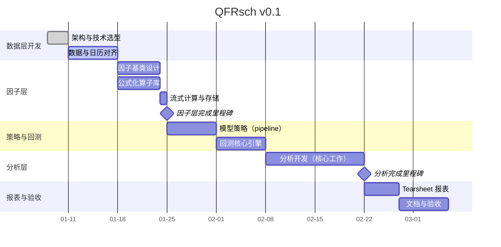

```table-of-contents
title: 
style: nestedList # TOC style (nestedList|nestedOrderedList|inlineFirstLevel)
minLevel: 0 # Include headings from the specified level
maxLevel: 0 # Include headings up to the specified level
include: 
exclude: 
includeLinks: true # Make headings clickable
hideWhenEmpty: false # Hide TOC if no headings are found
debugInConsole: false # Print debug info in Obsidian console
```


# 1 架构与功能


| 核心架构  | 设计理念                                                                                                                                                  | 功能                                                                                                                                 |
| ----- | ----------------------------------------------------------------------------------------------------------------------------------------------------- | ---------------------------------------------------------------------------------------------------------------------------------- |
| 数据层   | 配合Data-Infra构建数据库，包含：<br>1. 量价数据（OHLCV）、~~Tick数据、（Order book snapshots/Order-level）~~<br>2. 非结构化数据仓库（新闻、研报、社交媒体、10-K等）<br>3. 数据对齐: 交易日历和交易时间Alignment | 1. ETL与清洗：Pannel数据开发与抽取<br>2. 统一接口：对接模型层和回测系统<br>3. 对接Data-Infra平台数据管理                                                             |
| 因子层   | 提供标准的FactorBase基类和算子。参考[WorldQuant Brain - Alpha Language]([WorldQuant BRAIN](https://platform.worldquantbrain.com/learn/operators))                  | 1. 不同类型因子流式计算、预处理、合成<br>2. 公式化的因子计算，避免lookahead bias等                                                                              |
| 模型策略层 | 配置驱动 (Config-Driven) 的实验流程，解耦因子信号生成和策略组合优化                                                                                                            | 1. 集成 Sklearn，支持线性回归 (OLS)、树模型 (XGBoost) 及深度学习模型<br>2. 提供均值方差 (MVO)、风险平价 (Risk Parity) 等权重优化算法。<br>3. 提供经典策略如equal weight或者自定义策略交易 |
| 回测层   | 采用事件驱动回测引擎而不是向量化回测引擎                                                                                                                                  | 1. 净值计算：生成策略净值曲线<br>2. 成本模型：支持固定手续类、持有成本等<br>3.基础对比：可以对比大盘指数benchmark计算超额收益；                                                       |
| 分析层   | 包括：<br>1. 因子分析：IC分析、分层回测、自相关性分析、因子正交化等<br>2. 绩效归因：计算风险调整后收益等，生成Tearsheet                                                                              | 1. 风险指标：计算 Sharpe, Sortino, Calmar, MaxDrawdown等。<br>2. 交易特征：分析换手率 (Turnover)、持仓分布等。<br>3. 自动化报表：一键生成包含热力图、净值图、回撤图的 HTML/PDF 实验报告。 |

## 1.1 数据层

- 数据仓库架构：和Data-Infra对齐，不能导入Data-Infra的数据采用列式存储保证速度
- 时间对齐和日历：区分交易时段和非交易时段
- 主要支持美股，选择流动性最好的前3000只股票
## 1.2 因子层

- 因子基类设计：所有因子必须继承指定因子类，强制实现 `compute()` 方法
- 公式化算子库（Operator Library）: 时序算子、截面算子，并引入NLP特有的[算子]([WQ/operator_eng.pdf at main · KusuLeung/WQ](https://github.com/KusuLeung/WQ/blob/main/operator_eng.pdf))，同时增加因子处理函数如缺失值处理、正交化、去极值、多因子合成函数等
- 流式计算和存储：支持全量计算和增量计算


|                 |        |            |             |                  |             |     |
| --------------- | ------ | ---------- | ----------- | ---------------- | ----------- | --- |
| add             | log    | substract  | inverse     | not equal        | equal       | ... |
| ts_mean         | ts_max | ts_rank    | ts_quantile | ts_zscore        | ts_backfill | ... |
| last_diff_value | bucket | group_rank | trade_when  | group_neutralize | winsorize   | ... |


## 1.3 模型策略层

- 模型库集成：内置 OLS、Lasso、Ridge 回归、机器学习模型、深度学习模型等，细节参考Qlib方法，支持单因子、多因子建模、机器学习建模等
- 组合优化引擎：- 提供权重求解器（Solver）。输入为模型预测的收益率或得分，输出为目标持仓权重。支持行业中性、风格因子中性等约束条件
	- 计划使用skfolio或者qf-lib求解器
- 策略：自定义交易策略类，配合回测backtrader/bt引擎

## 1.4 回测层

- 采用事件驱动（Event-Driven）回测引擎。相比向量化回测速度稍慢，但能更精确地处理复杂的交易逻辑、资金管理、撮合细节和事件管理
- 参考使用backltrader/bt作为回测层的回测引擎，backtrader/bt是比较多用户使用的回测平台

## 1.5 分析层
- 因子评价体系：
	- 因子相关性分析
	- 单因子模型检验和分析（Moving Weighted Least Squares回归模型、T检验、IC、Factor Stability Coefficient, FSC、分组收益率等）
	- 收益风险模型
	- 多因子模型（Fama-MacBeth回归等）
	- 机器学习模型分析（机器学习因子作为单一因子FM回归、投资组合排序法、IC、SHAP等）
- 绩效归因：
	- 风险调整后收益、换手率等
	- 主动收益归因、主动风险归因
- 自动化报表

| 类别   | 评价指标           | 功能                                                             |
| ---- | -------------- | -------------------------------------------------------------- |
| 回撤   | 最大回撤           | 不同持仓周期的远期收益计算                                                  |
|      | 超额收益最大回撤       | 因子收益率计算                                                        |
| 收益率  | 年化收益率          | 因子换手率分析                                                        |
|      | 超额年化收益率        | 策略相对基准胜率                                                       |
|      | 收益率的显著性检验      | Newey-West 调整消除残差异方差与自相关性                                      |
| 波动率  | 年化波动率          | Fama-Macbeth 回归                             |
|      | 超额年化波动率        | 因子收益率的风险调整                                                     |
| 夏普比率 | 夏普比率           | 序贯排序双分组                                                        |
| 信息比率 | 信息比率           | Bybee, Kelly常用的IPCA(Instrumented Principal Component Analysis) |
| 相对胜率 | 策略相对基准胜率       |                                                                |
| 信息系数 | 信息系数均值         |                                                                |
|      | 信息系数标准差        |                                                                |
|      | 信息系数＞ 0 的比例    |                                                                |
|      | 信息系数＞ 0.03 的比例 |                                                                |
|      | Rank_IC 均值     |                                                                |
|      | Rank_ICIR      |                                                                |
|      |                |                                                                |

# 2 开发计划





# 3 验收与测试

## 3.1 测试案例

- 完美因子：构建一个“完美预测”因子（即使用 T+1 的收益率作为 T 日的因子值）
- 全程空仓：
- 全仓买入
- 尝试复现Bybee的文章，对比研究效果

## 3.2 性能验收

- 因子计算速度
- 回测加载速度
- 策略回测效率
- 内存占用

# 4 未来改进

QFRsch v0.2: 
- 必要的部分使用Py/C/Cpp/Rust进行重构，可能的需要改进的地方是计算速度、内存管理等
- 资产池在美股的基础之上，增加对A股等的支持
- 增加订单簿成交撮合、交易冲击等模拟手段
- 在日频的基础之上，增加分钟级别、tick级的数据回测支持
- 视需求增加因子分析、有效性检验的功能
# 5 调研

## 5.1 现在的回测工具


| 回测工具                                    | 归属                             | 优点                                                | 缺点                                 | 适用范围                 | 备注                                                                                                                                                                                                                                                           |
| --------------------------------------- | ------------------------------ | ------------------------------------------------- | ---------------------------------- | -------------------- | ------------------------------------------------------------------------------------------------------------------------------------------------------------------------------------------------------------------------------------------------------------ |
| Backtrader                              | Python / 开源                    | 事件驱动、功能全面；支持多资产、多时间周期；社区资料多                       | 大规模数据速度一般；原作者维护减弱，主要靠社区            | 股票/期货/加密；研究到小规模实盘仿真  | Apache-2.0；[backtrader](https://www.backtrader.com/)                                                                                                                                                                                                         |
| Backtesting.py                          | Python / 开源                    | 上手快、API 简洁；向量化速度快；适合教学/原型                         | 不擅长多资产/复杂撮合；组合层面能力有限               | 单标的策略、快速迭代           | MIT；[backtesting.py](https://github.com/kernc/backtesting.py)                                                                                                                                                                                                |
| vectorbt                                | Python / 开源                    | 高度向量化/Numba；参数扫描与热力图强；可扩展到大规模实验                   | 内存占用偏高；复杂事件驱动/撮合建模困难               | 信号研究、参数研究、组合分析       | MIT；商业版 vectorbt Pro 可选；[vectorbt](https://github.com/polakowo/vectorbt)                                                                                                                                                                                     |
| bt                                      | Python / 开源                    | 组合级回测（资产配置/因子轮动）简洁；与 pandas 生态良好                  | 不适合高频/日内；订单级细节较弱                   | 资产配置、月/周/日频          | BSD；[bt](https://github.com/pmorissette/bt)                                                                                                                                                                                                                  |
| Zipline Reloaded                        | Python / 开源                    | 经典框架；pipeline/因子研究成熟；与 QuantRocket/Blueshift 生态兼容 | 历史包（Zipline）停更；对新 pandas/py 适配需看分支 | 日频美股因子、教育/研究         | fork 仍在维护；[zipline-reloaded](https://github.com/stefan-jansen/zipline-reloaded)                                                                                                                                                                              |
| QSTrader                                | Python / 开源                    | 机构风格设计；风险与投资组合结构清晰                                | 社区体量较小；文档与生态不如主流                   | 日频股票/ETF、学术研究        | MIT；QuantStart 出品；[QSTrader](https://github.com/mhallsmoore/qstrader)                                                                                                                                                                                        |
| pysystemtrade                           | Python / 开源                    | 面向期货趋势/CTA；包含信号、风险、组合的全链路                         | 领域专用、学习曲线陡峭                        | 期货CTA、跨品种组合          | Rob Carver 项目；[pysystemtrade](https://github.com/robcarver17/pysystemtrade)                                                                                                                                                                                  |
| QuantConnect Lean                       | C#/Python / 开源引擎               | 多资产（股/期/期权/加密/外汇）；订单撮合与分红、公司行为完善；可本地或云端           | 学习曲线高；云端数据与回测可能收费                  | 专业/准生产级回测与研究         | Apache-2.0；[Lean](https://github.com/QuantConnect/Lean)                                                                                                                                                                                                      |
| Freqtrade                               | Python / 开源                    | 面向加密；内置回测、Walk-forward、超参搜索（hyperopt）             | 加密资产导向明显；传统资产支持有限                  | 加密量化、策略迭代            | GPL-3.0；[freqtrade](https://github.com/freqtrade/freqtrade)                                                                                                                                                                                                  |
| fastquant                               | Python / 开源                    | 封装 backtrader，API 友好；示例多                          | 复杂度受限于 backtrader；生态较小             | 入门、教学、快速试验           | MIT；[fastquant](https://github.com/enzoampil/fastquant)                                                                                                                                                                                                      |
| QuantRocket Moonshot                    | Python / 商业平台组件                | 向量化策略开发简洁；集成 IBKR 数据/执行                           | 依赖 QuantRocket 商业平台                | 股票/ETF 多市场研究         | 混合许可；[QuantRocket](https://www.quantrocket.com/)                                                                                                                                                                                                             |
| OpenBB Backtesting                      | Python / 开源                    | 终端式研究体验；集成数据源与绩效指标                                | 策略/撮合细节不如专用框架                      | 零售研究、绩效评估            | MPL-2.0；[OpenBB](https://github.com/OpenBB-finance/OpenBB)                                                                                                                                                                                                   |
| quantstrat (+ blotter/PA)               | R / 开源                         | 组合/订单簿级回测成熟；绩效分析强大                                | 语法与模块较陡峭；运行效率依赖实现                  | 日频股票/期货、学术研究         | GPL；与 TTR/PerformanceAnalytics 配套                                                                                                                                                                                                                            |
| BackTesting.jl                          | Julia / 开源                     | Julia 生态下高性能回测；向量化与速度优势                           | 生态较小；资料相对少                         | 研究、原型到高性能计算          | MIT；[BackTesting.jl](https://github.com/JuliaQuant/BackTesting.jl)                                                                                                                                                                                           |
| MATLAB Trading/Financial Toolbox        | MATLAB / 商业                    | 与 MATLAB 生态/可视化/优化无缝；稳健工程化                        | 付费；团队协作与扩展需许可                      | 企业/学术、资产配置/交易        | 具体函数随版本演进，需查文档                                                                                                                                                                                                                                               |
| AmiBroker                               | 商业（Windows）                    | 极快的组合回测与WF优化；AFL 简洁                               | 专有、Windows 优先；学习AFL                | 多市场日内/日频、零售/专业       | 付费；[AmiBroker](https://www.amibroker.com/)                                                                                                                                                                                                                   |
| NinjaTrader                             | 商业（C#）                         | 期货日内生态强；市场回放/优化工具完善                               | 主要面向期货/外汇；许可与生态绑定                  | 期货日内/盘中策略            | 付费/免费混合；[NinjaTrader](https://ninjatrader.com/)                                                                                                                                                                                                              |
| MetaTrader 5 Strategy Tester            | 商业（MQL5）                       | 外汇/差价合约生态；多线程/分布式优化                               | 经纪商绑定；股票/衍生品受限                     | 外汇/差价合约              | 免费客户端+经纪商生态；[MQL5](https://www.mql5.com/)                                                                                                                                                                                                                    |
| MultiCharts                             | 商业（EasyLanguage/PowerLanguage） | 易上手；与 TradeStation 语法兼容                           | 付费；跨平台受限                           | 期货/外汇/指数             | [MultiCharts](https://www.multicharts.com/)                                                                                                                                                                                                                  |
| TradeStation                            | 商业                             | 数据/下单/回测一体；社区大                                    | 经纪商绑定；策略迁移性一般                      | 美股/期货/外汇             | [TradeStation](https://www.tradestation.com/)                                                                                                                                                                                                                |
| Sierra Chart                            | 商业                             | 期货/成交明细能力强；回测与重放稳定                                | 界面/学习曲线偏硬核                         | 期货日内                 | [Sierra Chart](https://www.sierrachart.com/)                                                                                                                                                                                                                 |
| Blueshift                               | 云平台（QuantInsti）                | 云端回测、数据即服务；零部署                                    | 数据/配额/导出限制                         | 教学/研究/小规模实盘前研究       | 基于 Zipline；[Blueshift](https://blueshift.quantinsti.com/)                                                                                                                                                                                                    |
| Catalyst（已归档）                           | Python / 开源                    | 曾面向加密、多交易所                                        | 已停更，不建议新项目使用                       | 历史参考                 | Enigma 项目旧作；存档状态                                                                                                                                                                                                                                             |
| QF-Lib                                  | Python / 开源                    | 包含数据处理、信号/因子、回测、绩效与可视化的一体化框架；事件驱动与组合/风险控制模块较完整    | 社区体量较小、更新频率一般；生态插件较少               | 日/周频股票、ETF、因子与资产配置研究 |                                                                                                                                                                                                                                                              |
| Quantitative Investment Strategies: QIS | Python / 开源                    |                                                   |                                    |                      | [ArturSepp/QuantInvestStrats: Quantitative Investment Strategies (QIS) package implements Python analytics for visualisation of financial data, performance reporting, analysis of quantitative strategies.](https://github.com/ArturSepp/QuantInvestStrats) |
| DolphinDB                               | 闭源                             |                                                   |                                    |                      | [新用户入门指南（金融篇）](https://docs.dolphindb.cn/zh/tutorials/new_users_finance.html)<br>[基于 DolphinDB 的多因子风险模型实践](https://docs.dolphindb.cn/zh/tutorials/multi_factor_risk_model.html)                                                                              |
| Qlib                                    | 开源                             | 构建完整的量化研究工作流                                      |                                    |                      | [microsoft/qlib](https://github.com/microsoft/qlib)                                                                                                                                                                                                          |

## 5.2 现在的因子分析工具

| 回测工具             | 归属              | 优点                                                                 | 缺点                                                    | 适用范围             | 备注                         |
| :--------------- | :-------------- | :----------------------------------------------------------------- | :---------------------------------------------------- | :--------------- | :------------------------- |
| Alphalens        | Quantopian (开源) | 1. 专为因子分析设计（IC/IR、分层收益等）；<br>2. 与 Pandas 生态结合紧密；<br>3. 极其直观的图表可视化。 | 1. 仅做因子分析，不包含交易撮合引擎；<br>2. 原作者停止维护（现有社区版）。            | 纯因子有效性检验、单因子分析   | 因子研究必学的标准库，常配合 Zipline 使用。 |
| DolphinDB / KDB+ | 商业时序数据库         | 1. 极致的计算性能（C++底层）；<br>2. 存算一体，处理海量 Tick 数据极快；<br>3. 向量化编程。         | 1. 需要学习专门的脚本语言；<br>2. 商业授权费用高昂；<br>3. 生态不如 Python 丰富。 | 机构级高频因子计算、海量数据清洗 | 许多头部私募的底层数据清洗与因子计算首选。      |

## 5.3 因子

### 5.3.1 横截面因子和时序因子

- 横截面因子
	- $R_{i,t}​=\alpha + \beta_1 \times Value_{i,t} ​+ \beta_{2} \times Momentum_{i,t} ​+ \cdots + \varepsilon_{i,t}​$
- 时序因子
	- $R_t = \alpha + \beta_1 \cdot \text{GDP-growth}_t + \beta_2 \cdot \text{Inflation}_t + \dots + \varepsilon_t$

| 维度   | 横截面因子                    | 时序因子                 |
| ---- | ------------------------ | -------------------- |
| 分析对象 | 多个资产在同一时间的表现差异           | 单一资产（或市场）在不同时间的表现变化  |
| 数据结构 | 截面数据（N个资产 × 1个时间点）       | 时间序列数据（1个资产 × T个时间点） |
| 典型因子 | 价值、动量、质量、规模              | 利率、通胀、GDP、信用利差、波动率   |
| 主要用途 | 选股、构建多空组合、因子暴露分析         | 资产配置、宏观对冲、风险预警       |
| 模型代表 | Fama-MacBeth 回归、Barra 模型 | CAPM（市场因子）、宏观因子模型    |
在实践中，横截面与时序视角常常结合：
- Fama-MacBeth 两步法
- 动态因子模型：允许因子载荷（factor loadings / $\beta$）随时间变化，融合横截面与时序信息

### 5.3.2 因子来源

- 风格因子
	- Value \ Momentum \ Quality \ Size \ Low Volatility \ Growth
- 宏观因子
	- GDP \ Inflation \ Rate \ FX
- 行业板块因子
- 另类因子
	- 流动性因子 \ ESG \ 文本因子等
-  机器学习因子：基于上述各类原始来源，通过机器学习算法挖掘的非线性 / 交互型因子（如价量特征交叉因子、舆情文本嵌入因子）
### 5.3.3 因子构建方式

- 原始因子: 直接从财务数据或市场数据计算得出（如 ROE、换手率
- 标准化\中性化因子: 经过行业中性、市值中性等调整，剔除其他因子干扰。
- 合成因子: 将多个相关原始因子加权合成一个综合指标
- 机器学习因子：高维原始特征中自动学习 “特征→收益” 的映射关系，生成因子信号
### 5.3.4 因子用途
- 解释性因子
	- CAPM, FAMA-FRENCH
- 预测性因子
- 风险因子
	- Barra因子模型
- 机器学习因子


# 6 Reference

[新用户入门指南（金融篇）](https://docs.dolphindb.com/zh/tutorials/new_users_finance.html)

[因子计算最佳实践](https://docs.dolphindb.cn/zh/tutorials/best_practice_for_factor_calculation.html#6-%E5%9B%A0%E5%AD%90%E5%9B%9E%E6%B5%8B%E5%92%8C%E5%BB%BA%E6%A8%A1)

[基于 DolphinDB 的多因子风险模型实践](https://docs.dolphindb.cn/zh/tutorials/multi_factor_risk_model.html#ugz_fdg_41c)

[基于 DolphinDB 构建高性能因子评价框架](https://docs.dolphindb.cn/zh/tutorials/factor_evaluation_framework.html#topic_cfy_lqd_xfc)

[Alphalens 在 DolphinDB 中的应用：因子分析建模实践](https://docs.dolphindb.cn/zh/tutorials/Practical_Factor_Analysis_Modeling.html)

[基于 DolphinDB 的因子归因分析](https://docs.dolphindb.cn/zh/tutorials/factor_attribution_analysis.html)

[基于 DolphinDB 的 Campisi 绩效归因模型实践](https://docs.dolphindb.cn/zh/tutorials/campisi.html)

[WQ/operator_eng.pdf at main · KusuLeung/WQ](https://github.com/KusuLeung/WQ/blob/main/operator_eng.pdf)

https://quarkfin.github.io/qf-lib-info/